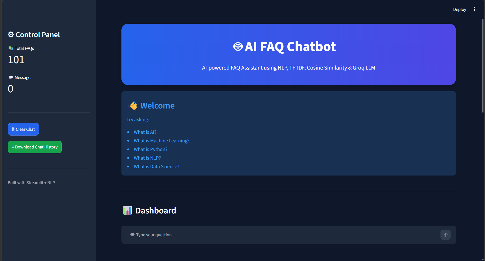
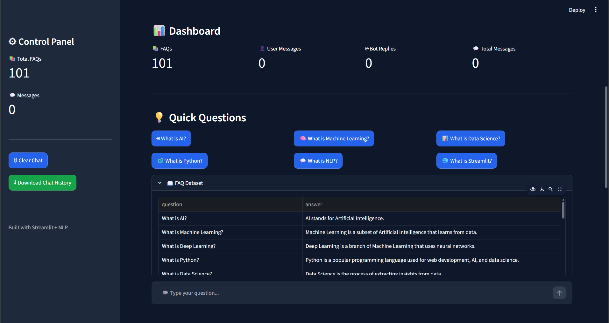
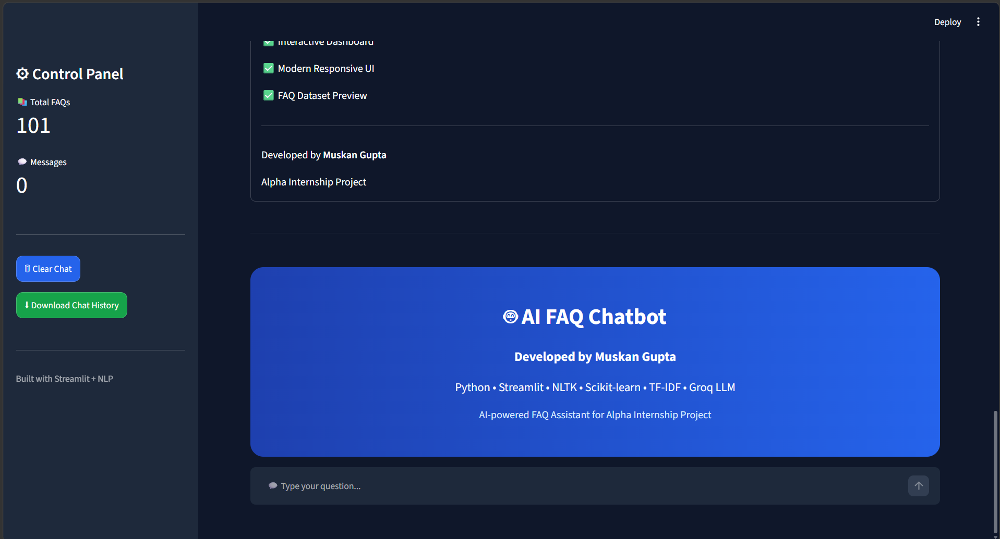
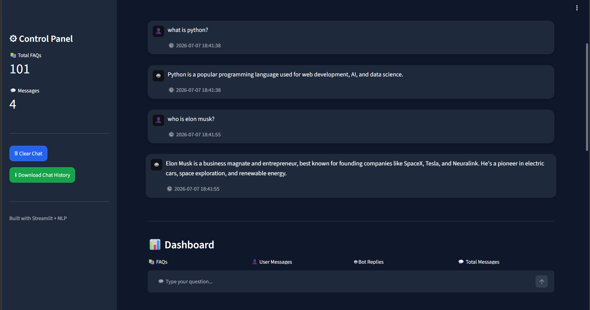
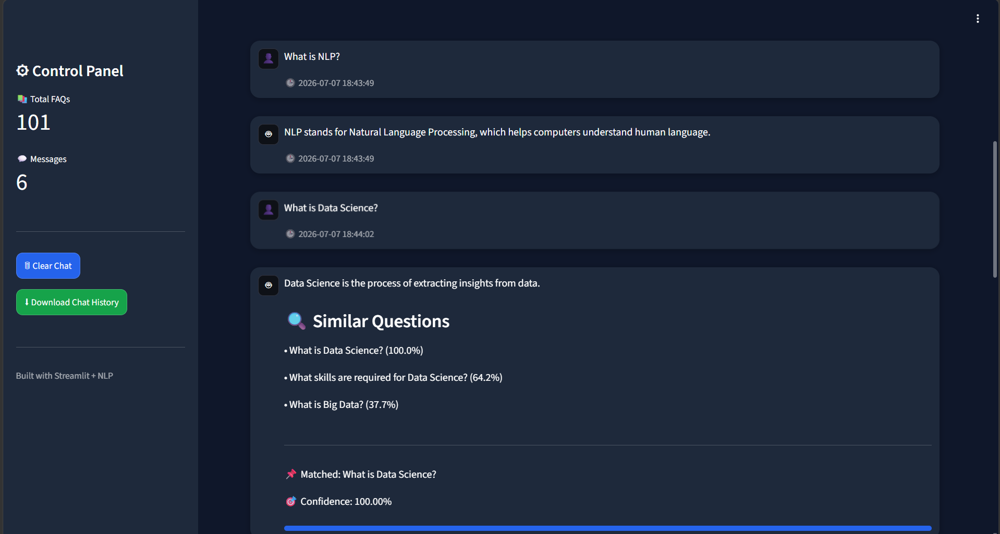

# 🤖 AI FAQ Chatbot

<p align="center">


</p>

<p align="center">
An AI-powered FAQ Chatbot built using <b>Python, Streamlit, NLP, TF-IDF, Cosine Similarity, Scikit-learn, and Groq LLM</b>.
</p>

<p align="center">
The chatbot first searches a FAQ knowledge base using Natural Language Processing. If no relevant FAQ is found, it automatically generates an intelligent response using the Groq Large Language Model (LLM).
</p>

---

# 🚀 Features

- 🤖 AI-powered FAQ Chatbot
- 🧠 Groq LLM Integration
- 🔍 TF-IDF Vectorization
- 📊 Cosine Similarity Matching
- 📝 NLP Text Preprocessing
- 💬 Interactive Chat Interface
- 📜 Chat History
- 📈 Dashboard with Statistics
- 💡 Quick Question Buttons
- 📖 FAQ Dataset Preview
- 🎯 Confidence Score
- 🔎 Similar Question Suggestions
- ⬇ Download Chat History (JSON)
- ⚡ Modern Streamlit UI

---

# 🛠️ Tech Stack

| Technology | Purpose |
|------------|---------|
| Python | Programming Language |
| Streamlit | Web Application |
| Pandas | Data Handling |
| NLTK | NLP Preprocessing |
| Scikit-learn | Machine Learning |
| TF-IDF | Text Vectorization |
| Cosine Similarity | Similarity Search |
| Groq LLM | AI Response Generation |
| JSON | Chat History Export |

---

# 📂 Project Structure

```text
AI-FAQ-Chatbot/
│
├── app.py
├── chatbot.py
├── utils.py
├── faq.csv
├── requirements.txt
├── README.md
├── .gitignore
├── images/
│   ├── home_page1.png
│   ├── home_page2.png
│   ├── home_page3.png
│   ├── home_page4.png
│   ├── home_page5.png
│   └── home_page6.png
└── venv/
```

---

# 📸 Project Screenshots

## 🏠 Home Page



>Main landing page of the AI FAQ Chatbot with a clean and modern Streamlit interface.

---

## 📊 Dashboard & Quick Questions



>Displays chatbot statistics and quick question buttons for faster interaction.

---

## ✨ Features & Sidebar


>Sidebar with chatbot controls, download option, and feature overview.

---

## 💬 Chat Interface



>Interactive chat interface where users can ask AI-related questions.

---

## 📖 FAQ Dataset Preview



>Expandable FAQ dataset preview displaying available questions and answers.

---

## 🤖 AI Response & Confidence Score



>Displays AI-generated response, matched question, confidence score, and similar question suggestions.

---

# ⚙️ Installation

### 1️⃣ Clone the Repository

```bash
git clone https://github.com/muskan-gupta01/AI-FAQ-Chatbot.git
```

### 2️⃣ Open Project Folder

```bash
cd AI-FAQ-Chatbot
```

### 3️⃣ Create Virtual Environment

```bash
python -m venv venv
```

### 4️⃣ Activate Virtual Environment

#### Windows

```bash
venv\Scripts\activate
```

#### Linux / macOS

```bash
source venv/bin/activate
```

### 5️⃣ Install Dependencies

```bash
pip install -r requirements.txt
```

---

# 🔑 Configure Groq API Key

Create a `.env` file in the project directory.

Add your Groq API Key:

```text
GROQ_API_KEY=your_groq_api_key_here
```

---

# ▶️ Run the Application

```bash
streamlit run app.py
```

---

# 🧠 How It Works

1. User enters a question.
2. NLP preprocesses the input text.
3. TF-IDF converts the text into vectors.
4. Cosine Similarity searches the FAQ dataset.
5. If a relevant FAQ is found, the chatbot returns the stored answer.
6. If no suitable FAQ is found, the chatbot generates a response using the Groq LLM.
7. The conversation is stored in chat history.
8. Users can download the chat history in JSON format.

---

# ✨ Key Highlights

- AI-powered FAQ Assistant
- NLP-based Question Processing
- TF-IDF & Cosine Similarity Search
- Groq LLM Integration
- Confidence Score
- Similar Question Suggestions
- Interactive Chat Interface
- Dashboard with Statistics
- Download Chat History
- FAQ Dataset Preview
- Modern Streamlit UI
- Cached Model Loading
- Fast Response Time

---

# 🔮 Future Improvements

- 🎤 Voice Input
- 🔊 Text-to-Speech
- 🌍 Multi-language Support
- 📄 PDF Knowledge Base
- 🗄 Database Integration
- 👤 User Authentication
- ☁️ Streamlit Cloud Deployment
- 📱 Mobile Responsive UI

---

# 👩‍💻 Developer

## Muskan Gupta

### 💼 LinkedIn

https://linkedin.com/in/muskan-gupta-551293386

### 💻 GitHub

https://github.com/muskan-gupta01

---

# 🎯 Project Purpose

This project was developed to demonstrate the practical implementation of:

- Natural Language Processing (NLP)
- Information Retrieval using TF-IDF
- Cosine Similarity Search
- Large Language Model (Groq LLM)
- Interactive Web Application Development with Streamlit

It serves as a portfolio project for AI/ML learning, internships, and technical showcases.

---

# ⭐ Support

If you found this project useful, please consider giving it a ⭐ on GitHub.

---

# 📄 License

This project is intended for educational, learning, portfolio, and internship purposes.

© 2026 Muskan Gupta. All Rights Reserved.

---
Thank You! ❤️
